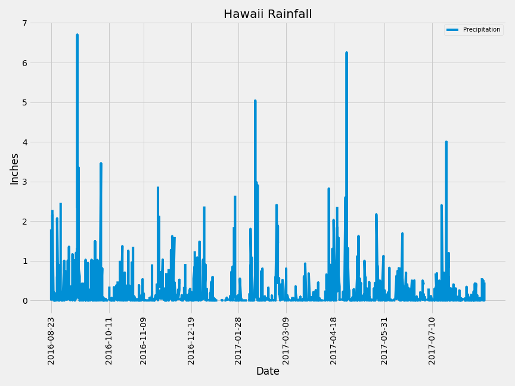
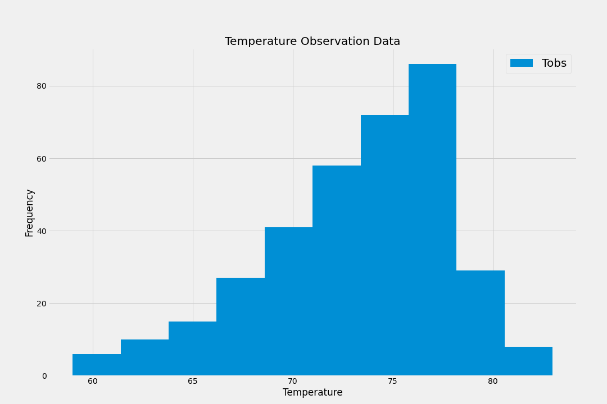

# Sqlalchemy Overview

The goal of this project/repository is to create multiple histograms from a Hawaii weather database and then create an API from said database. This is created for others to pull specific information such as the amount of rainfall for a day or range of days. See the steps below for each section of the related analysis and application.

# Exploratory Precipitation Analysis

The goal of the precipitation analysis is to understand what trends exist over the course of a year in order to predict when rain may fall.

1. In order to pull any data from an sqlite database, an **engine** must be created which was completed by writing `engine = create_engine("sqlite:///hawaii.sqlite")`. 

2. Once the connection has been established, a query, `session.query(measurement.date).order_by(measurement.date.desc()).first()` was run in order to collect the most recent date inside the db. 

3. To better understand the trends over a year in Hawaii, a timedelta function was created, `dt.date(2017,8,23) - dt.timedelta(days=365)` in order to pull data from an entire year. 

4. Now that the dates for the year have been established, a loop was created in order to pull the data.

5. Once the data for the entire year has been pulled, a dataframe is created via `pd.DataFrame(precip_data, columns = ['date', "prcp"])` which is illustrated below.

6. By being able to isolate the data into a series, a plot of the data can be made to compare the dates and the total amount of precipitation for each day from 2016-08-23 to 2017-08-23 as seen below.

# Station Analysis

The goal of the station analysis was to better understand if there is a relationship between the temperature of a location and the frequency of rain.

1. The first step is to isolate the locations associated with the database. In order to complete that, a query... `active_station = session.query(measurement.station).group_by(measurement.station).order_by(func.count(measurement.date).desc()).first()` is used to pull the most active location id.

2. Once the most active ID, **USC00519281**, was isolated, another query was used to pull all of the TOBS data for the previous year. `session.query(measurement.tobs).filter(measurement.station==most_active).filter(measurement.date>=date).all()`

3. Once the data was pulled and isolated, a histogram was created to show the relationship of temperature and fequency of precipitation. See graph below.

# Creating an API

In order for individuals to be able to pull the data from the database, an **API** was created with multiple routes for different kinds of information.

1. If somebody wants to pull the precipitation data for specific dates, they would use... `/api/v1.0/precipitation`.

2. If somebody wants to pull the station name and ID they would use... `/api/v1.0/stations`.

3. If somebody wanted to pull the TOBS data for the date range of 2016-08-23 to 2017-08-23 they would use... `/api/v1.0/tobs`.

4. Lastly, if the same data wanted to be pulled for a range, the api route would be... `/api/v1.0/<start_date>/<end_date>`.
