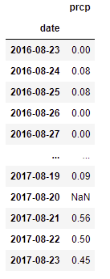

# Sqlalchemy_Challenge

# Sqlalchemy Overview

The goal of this project/ repository is to create multiple histograms from a hawaii weather database and then create an API from said database in order for others to pull specific information such as the amount of rainfall for a day or range of days. See the steps below for each section of the related analysis and application.

# Exploratory Precipitation Analysis

The goal of the precipitation analysis is to understand what trends exist over the course of a year in order to predict when rain may fall.

1. In order to pull any data from an sqlite database, an `engine` must be created which was completed by writing `engine = create_engine("sqlite:///hawaii.sqlite")`. 

2. Once the connection has been established, a query, `session.query(measurement.date).order_by(measurement.date.desc()).first()` was run in order to collect the most recent date inside the db. 

3. To better understand the trends over a year in Hawaii, a timedelta function was created, `dt.date(2017,8,23) - dt.timedelta(days=365)` in order to pull data from an entire year. 

4. Now that the dates for the year have been established, a loop was created in order to pull the data.

5. Once the data for the entire year has been pulled, a dataframe is created via `pd.DataFrame(precip_data, columns = ['date', "prcp"])` which is illustrated below.

